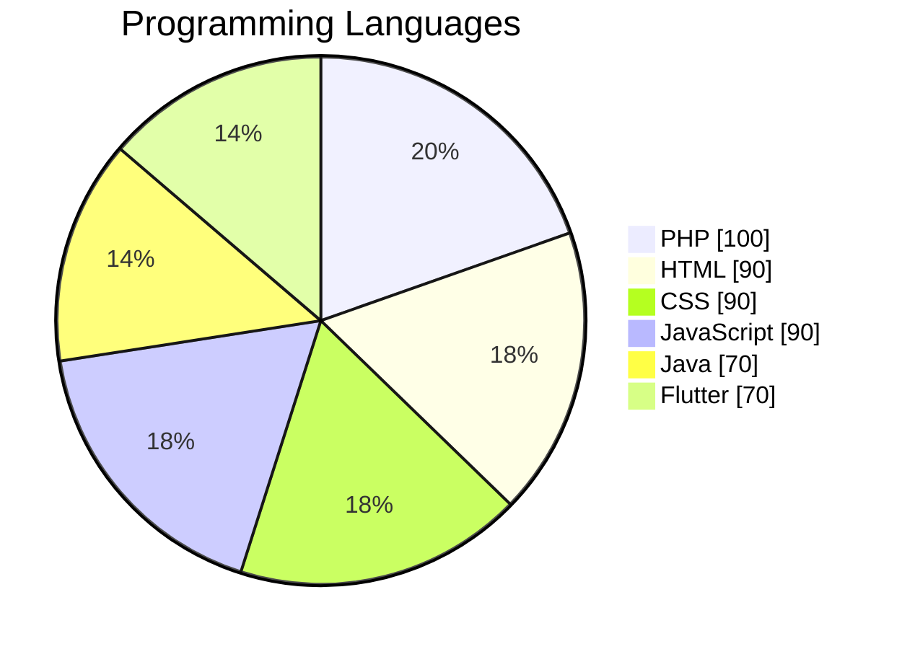

# Faisal Syarifuddin

## 🚀 About Me
I am a **Full Stack Developer** with 4 years of experience specializing in ​**PHP**. I have successfully created and developed a variety of websites, ​including both corporate and personal projects. My expertise spans **full-​stack development**, ensuring robust and user-friendly web solutions.

## 🛠 Skills
- `Programming Languages:` PHP, HTML, CSS, JavaScript, Java, Flutter
- `Frameworks & Libraries:` Laravel, CodeIgniter, Bootstrap, jQuery, Ext JS, Spring Boot, Leaflet, API
- `Databases:` MySQL, PostgreSQL, Microsoft SQL Server, Oracle
- `Development Tools:` IntelliJ IDEA, Visual Studio Code, Postman, Insomnia, SoapUI, Git, GitHub, GitLab, Subversion, DBeaver, Navicat, Laragon, XAMPP
- `Operating Systems & Server Management:` RedHat, CentOS, Nginx, Remote Desktop

## 🔗 Links

